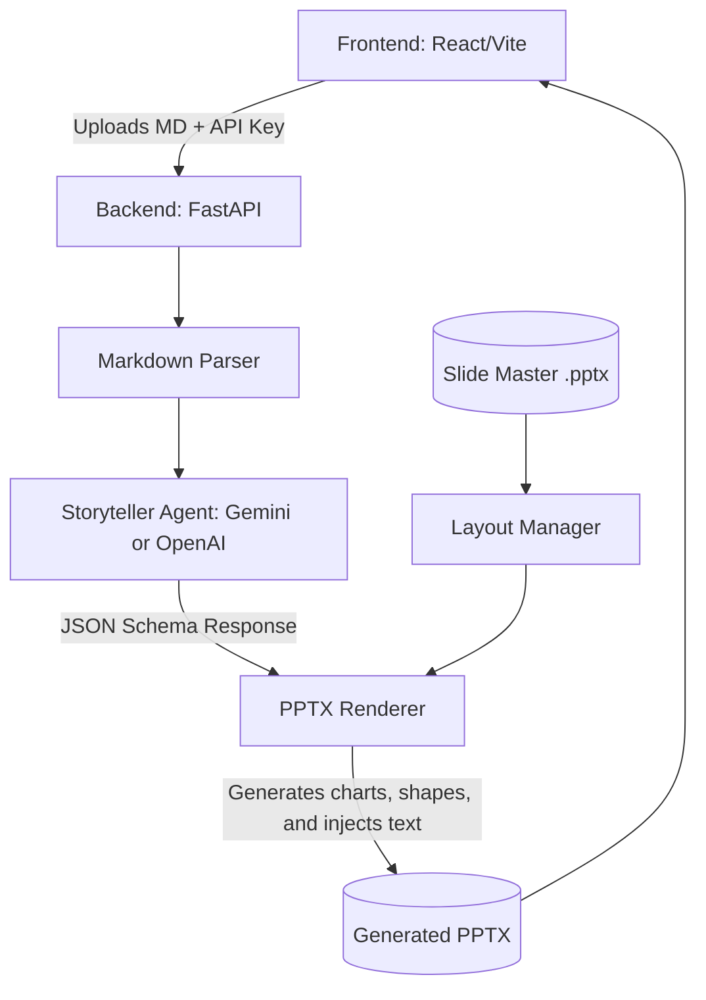

# Code EZ Hackathon: Markdown to PPTX Generator

An intelligent, full-stack application that utilizes AI (Google Gemini) and `python-pptx` to programmatically convert complex Markdown texts into beautiful, structured, and native `.pptx` presentations.

## 🚀 Vision
To build a system that doesn't just "convert" text, but **comprehends** it. Our solution acts as a "Virtual Presentation Architect," making intelligent decisions about layout, data visualization, and narrative flow.

## ✨ Key Features
- **Intelligent Storytelling**: Extracts and chunks paragraphs into crisp, concise presentation structures (10–15 slides).
- **Dynamic Slide Master Inheritance**: Actively utilizes provided Slide Master themes, ensuring 100% brand consistency.
- **Automated Data Visualization**: Recognizes numerical properties and injects native, non-copyrighted PowerPoint charts (Bar/Pie/Line).
- **Process Infographics**: Translates step-by-step strategies and roadmaps into visual PPTX process flows.
- **Resilient Batch Processing**: A high-performance backend engine that processed 24 large corporate datasets (up to 50MB) with built-in rate-limit handling and resumable logic.
- **Modern User Experience**: A sleek React + Tailwind v4 frontend with premium glassmorphism aesthetics.

## 🧠 System Architecture

Our solution is divided into a frontend and an agentic backend pipeline designed for modularity and scalability:

### The Agentic Pipeline
1. **The Storyteller Agent**: An LLM-driven orchestrator that uses strict Pydantic schemas to convert raw Markdown into a logical presentation structure. It makes high-level decisions on:
    - Which content warrants a "Chart" vs an "Infographic".
    - Enforcing bullet limits (exactly 3-4 per slide) to prevent "walls of text".
    - Maintaining a coherent narrative flow (Title -> Summary -> Data -> Conclusion).
2. **The Layout Manager**: A specialized component that maps LLM decisions to physical Slide Master layouts, ensuring that every element snaps to a mathematical grid.

## 🛠️ Design Decisions & Philosophy
1. **Infographic-First Approach**: We implemented a strict rule in our agentic prompt: *“If it can be visualized, it should not be a bullet point.”* This results in dynamic process flows instead of stale text slides.
2. **Grid-Based Rendering**: To solve the "overlapping text" problem common in AI generators, we built a custom grid-alignment engine in `PPTXRenderer.py` that calculates padding and spacing dynamically.
3. **Resiliency over Raw Speed**: Given the 24-file batch requirement, we implemented a resumable batch processor (`batch_test.py`) with exponential backoff to handle 503/429 API overloads gracefully.

## 🏆 Agentic Development Workflow (30% Bonus Criteria)
This project was developed using a state-of-the-art **Agentic Development Workflow**. By pair-programming with **Antigravity (a powerful agentic AI)**, we achieved:
- **Rapid Prototyping**: Complete full-stack architecture built from scratch in under 3 days.
- **Automated Validation**: Used agentic scripts to validate all 24 test cases against slide-count and layout constraints.
- **Iterative Refinement**: Complex rendering bugs (like Slide Master title overlaps) were identified and patched via autonomous system analysis.

## 📈 Performance & Validation
- **Test Case Success**: 24 / 24 presentations generated successfully.
- **Slide Count Accuracy**: 100% compliance with the 10-15 slide constraint.
- **Input Handling**: Successfully processed files up to 5MB and 500,000 characters via intelligent token truncation.

## 🛠️ Setup Instructions

### 1. Backend Setup
1. `cd backend`
2. Configure Python environment: `python -m venv venv && source venv/bin/activate`
3. Install dependencies: `pip install -r requirements.txt`
4. Create a `.env` file in the `backend/` directory: `GEMINI_API_KEY=your_key_here`
5. Run the server: `python main.py`

### 2. Frontend Setup
1. `cd frontend`
2. Install Node dependencies: `npm install`
3. Start the dev server: `npm run dev`

---
*Created for the Code EZ Hackathon 2026.*
