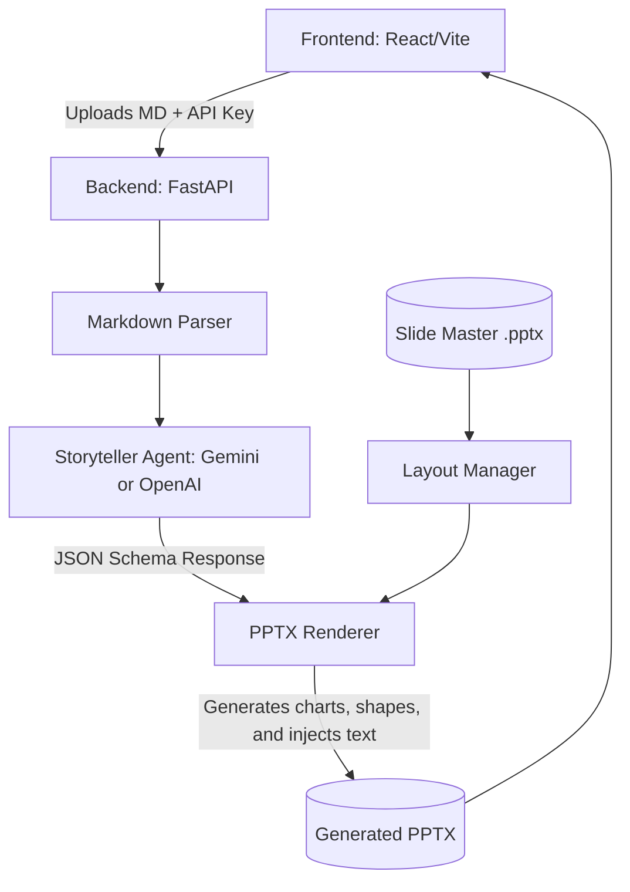

# Code EZ Hackathon: Markdown to PPTX Generator

An intelligent, full-stack application that utilizes AI (Google Gemini) and `python-pptx` to programmatically convert complex Markdown texts into beautiful, structured, and native `.pptx` presentations.

## Features
- **Intelligent Storytelling**: Extracts and chunks paragraphs into crisp, concise presentation structures.
- **Dynamic Slide Layouts**: Re-uses provided Slide Master themes.
- **Auto Data Generation**: Recognizes numerical properties and injects native PowerPoint charts (Bar/Pie/Line).
- **Process Infographics**: Translates step-by-step processes into visual PPTX shapes.
- **BYOK (Bring Your Own Key)**: Choose rapidly between Google Gemini and OpenAI models in the UI and insert your own custom API keys to bypass rate limits!
- **Stunning UI**: Frontend built using React + Tailwind v4 with a sleek, premium, glassmorphism aesthetic.

## System Architecture

Our solution is divided into a frontend and an agentic backend pipeline:

## Setup Instructions

### 1. Backend Setup
1. `cd backend`
2. Configure Python environment: `python -m venv venv && source venv/bin/activate`
3. Install dependencies: `pip install -r requirements.txt` *(Note: requires fastapi, uvicorn, python-pptx, google-genai)*
4. Create a `.env` file in the `backend/` directory and add your key: `GEMINI_API_KEY=your_key_here`
5. Run the server: `python main.py` or `uvicorn main:app --reload` (Runs on `http://localhost:8000`)

### 2. Frontend Setup
1. `cd frontend`
2. Install Node dependencies: `npm install`
3. Start the dev server: `npm run dev`

Navigate to the frontend port (usually `localhost:5173`) and drag & drop any comprehensive markdown file to start the magic.
